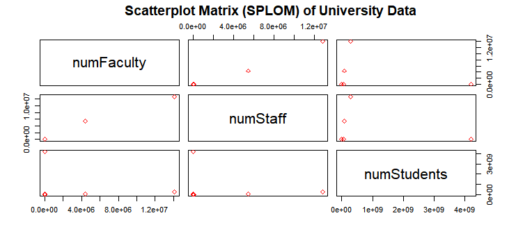
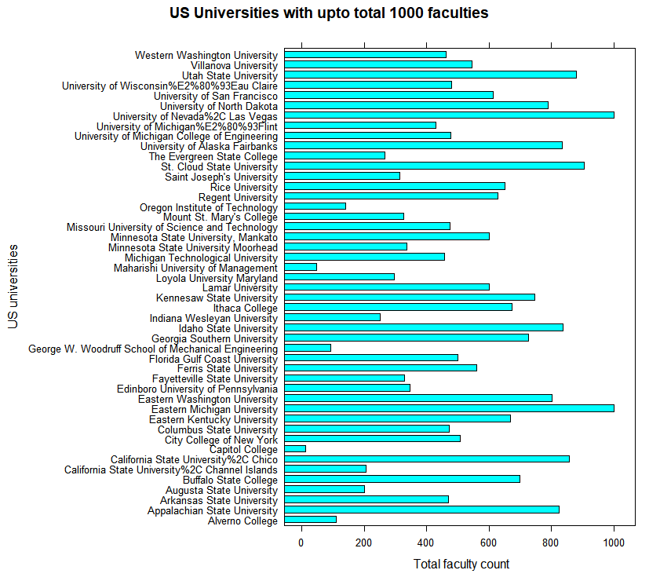

Kamla Kant Tripathi, CS 725/825, Fall 2017

# Information Visualization - VI6, CS 725/825, Fall 2017

## Satterplot Matrix (SPLOM) using R:
 
 
## Description:
 To plot a SPLOM in R, I chose VI2 data named as "universityData-csv.csv". By following the assignment instructions, 
 I selected the three attributes from this data viz. number of faculty, number of students, and number of staffs of only US universities. After refining the data in openRefine, 
 I have remaining data in 97 rows. This csv data is named as "vi6.csv". <br>
  Through this SPLOM, I am visualizing the number of faculty, number of staff, and number of 
  students ratio of the US universities. Since, there are more than two attributes for the visualization, the scatter plot matrix is a best fit to represent the plot.

### Insights:

<ul>
    <li>In this chart, if we see the number of faculty and number of students 
    ratio, the faculty ratio is lesser than the students' ratio, in general. But for the one university, there 
    are more students in comparison to the faculty count. Similarly in another university, there are very less 
    students than faculties. Aditionally, in two universities, faculty and student demographics are very less.</li>
    <li>In comparison of number of staff and the number of students, the result is similar that the number of 
    students ratio is more than the number of staff. For the two universities, both the staff and students have lesser population.</li>
  <li> By these observations, I inferred that there are some universities which have low faculty count and staff. 
  Though, there might be a reason like if university is a small university. However, this insight gives me 
  a curiosity to plot a bar chart for the universities with the lesser number of faculties.</li>
</ul>

# SPLOM Code
```ruby
# developer: K.K. Tripathi
#date: 10/26/2017
#-------------------------
# scatterplot matrix
# read csv data
data = read.csv("vi6.csv")

#read selected columns
pairs(data[2:4], pch = 23, col="red")

#scatterplot title
title("Scatterplot Matrix (SPLOM) of University Data", line = 3)

```

## Code description:
In this aforementioned R code, first I read the csv data file then used the 'pairs' method to choose desired columns 2 to 4 from the dataset which are 
numerical attributes- numFaculty, numStaff, and numStudents respectively. In this scatter plot matrix representation, I used "pch = 24" to represent plot 
points in diamond shape because it is easy to differentiate between two overlapping points. 
Aditionally, to make is visually discrete I used red color for it's color parameter.
For this scatterplot, 'title' method have been used to give it a title named as 'Scatterplot Matrix (SPLOM) of University Data' and to make it in the right position
'line' method have been used as value 3.

## Bar Chart in R:


After plotting the scatter plot, I wanted to know the list of universities with the lower count of faculties through bar chart visualization in R.
Hence, I refined the same data again where I kept data only with equal to and less than 1000 number of faculties.
 
## Description:
This bar chart represents the number of faculties vs. US universities through x and y-axis respectively.
There are total 47 universities (rows) in this data file named 'vi6barchart.csv'.
<br> Through this bar chart, data is very easy to interpret in terms of minimum and maximum number of faculty count in each university because horizontal bar chart helps us to compare the
faculty counts between each university.

### Insights: 


<b> Universities with the most number of faculties.</b>
        <ul>
            <li> Eastern Michigan University and University of Nevada, Las Vegas are at the top position with exact 1000 faculties.</li>
            <li>The secound largetst universities with faculty counts are St. Cloud State University followed by Utah State University 
                and California State University which have around 900 faculties.</li>
        </ul>
<b>Universities with the least number of faculties.</b>
        <ul>
            <li> Capitol College is a school which has the lowest number of faculty count (only 12 faculties)
            followed by Maharishi University of Management and George W. Woodruff School of Mechanical Engineering which have around 100 faculties. </li>
        </ul>

<br>
# Bar chart Code:
```ruby
# developer: K.K. Tripathi
#date: 10/26/2017
#-------------------------
#bar chart
# read csv data
data = read.csv("vi6barchart.csv")

# plot bar chart
barchart(data$university~data$numFaculty,
         scales=list(x=list(cex=0.8)), 
         xlab = " Total faculty count", 
         ylab = "US universities", 
         main = "US Universities with upto total 1000 faculties")

```

# Bar chart Code Description
In this bar chart code, I used csv data 'vi6barchart.csv' as input file. To plot this chart, 'barchart' method which represents the 
'university' and 'numFaculty' attributes of csv data file have been used. For the label representations of x and y-axis, 'xlab' and 'ylab' 
arguments have been used to label the total faculty count and US universities respectively. The 'main' argument have been used to give the title of this bar 
chart which is 'US Universities with upto total 1000 faculties'.

## Project data source:
 The csv data is used in this project is taken from the following link: 

* [VI 2 assignment of this course](https://git-community.cs.odu.edu/ktripath/VI2/blob/master/universityData-csv.csv)
